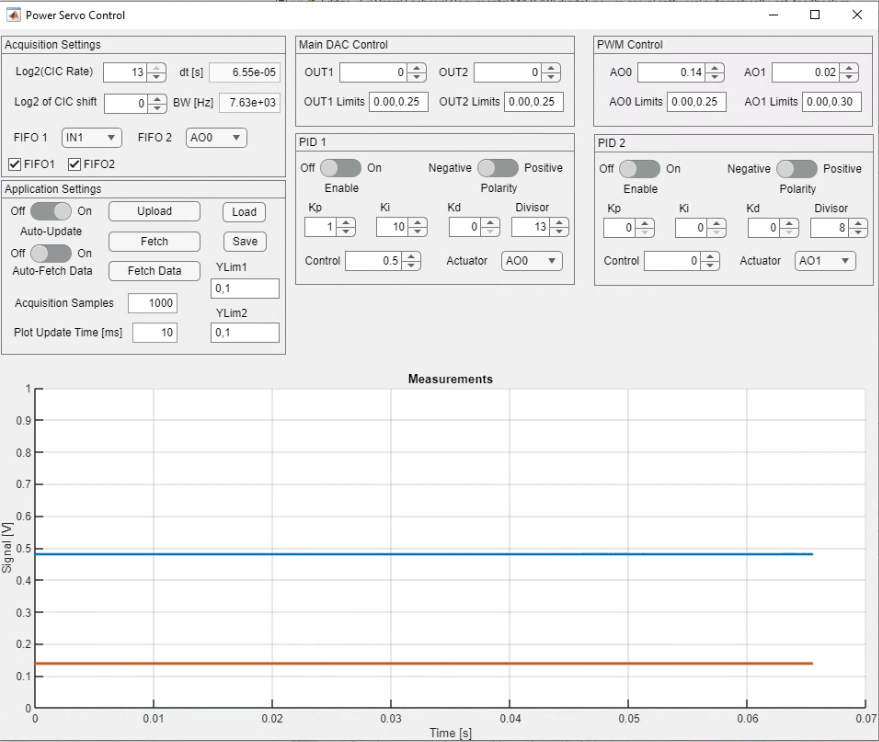

# Digital Power Servo

This project implements a reasonably general-purpose digital power servo or lock using the Red Pitaya STEMlab 125-14 (or 125-10 with minor modifications) platform.  Measurements are made with the two ADCs (ports IN1 and IN2), and then actuator values are produced using either the fast DACs (ports OUT1 and OUT2) or using the slower PWM outputs AO0 and AO1.  Actuator values are calculated using a PID algorithm.  

# Software set up

  1. Clone both this repository and the interface repository at [https://github.com/atomlaser-lab/red-pitaya-interface](https://github.com/atomlaser-lab/red-pitaya-interface) to your computer.  

  2. Connect the Red Pitaya (RP) board to an appropriate USB power source (minimum 2 A current output), and then connect it to the local network using an ethernet cable.  Using SSH (via terminal on Linux/Mac or something like PuTTY on Windows), log into the RP using the hostname `rp-{MAC}.local` where `{MAC}` is the last 6 characters of the RP's MAC address, which is written on the ethernet connector.  Your network may assign its own domain, so `.local` might not be the correct choice.  The default user name and password for RPs is `root`.  Once logged in, create two directories called `power-servo` and `server`.

  3. From this repository, copy over all files in the 'software/' directory ending in '.c' and the file `Makefile` to the `power-servo` directory on the RP using either `scp` (from a terminal on your computer) or using your favourite GUI (I recommend WinSCP for Windows).  Also copy over the file `fpga/power-servo.bit` to the `power-servo` directory.  From the interface repository, copy over all files ending in '.py' and the file 'get_ip.sh' to the `server` directory on the RP.

  4. On the RP and in the `power-servo` directory, compile the C programs.  You can compile these using the Makefile by running the command `make` with no arguments.  This will compile all the C programs in the directory.  

  5. In the `server` directory, change the privileges of `get_ip.sh` using `chmod a+x get_up.sh`.  Check that running `./get_ip.sh` produces a single IP address (you may need to install dos2unix using `apt install dos2unix` and then run `dos2unix get_ip.sh` to make it work).  If it doesn't, run the command `ip addr` and look for an IP address that isn't `127.0.0.1` (which is the local loopback address).  There may be more than one IP address -- you're looking for one that has tags 'global' and 'dynamic'.  Here is the output from one such device:
   ```
   root@rp-f0919a:~# ip addr
   1: lo: <LOOPBACK,UP,LOWER_UP> mtu 65536 qdisc noqueue state UNKNOWN group default qlen 1
      link/loopback 00:00:00:00:00:00 brd 00:00:00:00:00:00
      inet 127.0.0.1/8 scope host lo
         valid_lft forever preferred_lft forever
      inet6 ::1/128 scope host 
         valid_lft forever preferred_lft forever
   2: eth0: <BROADCAST,MULTICAST,UP,LOWER_UP> mtu 1500 qdisc pfifo_fast state UP group default qlen 1000
      link/ether 00:26:32:f0:91:9a brd ff:ff:ff:ff:ff:ff
      inet 169.254.176.82/16 brd 169.254.255.255 scope link eth0
         valid_lft forever preferred_lft forever
      inet 192.168.1.109/24 brd 192.168.1.255 scope global dynamic eth0
         valid_lft 77723sec preferred_lft 77723sec
   3: sit0@NONE: <NOARP> mtu 1480 qdisc noop state DOWN group default qlen 1
      link/sit 0.0.0.0 brd 0.0.0.0
   ```
   The IP address we want here is the address `192.168.1.109` as it has the `global` tag, which is what `get_ip.sh` looks for.  If you have your RP connected directly to your computer it will not work and you will have to specify the IP address manually.

   6. Upload the bitstream to the FPGA by navigating to the `power-servo` directory and running `cat power-servo.bit > /dev/xdevcfg`.

   7. Start the Python server by running `python3 /root/server/appserver.py`.  If you need to specify your IP address run instead `python3 /root/server/appserver.py <ip address>`.  The script will print the IP address it is using on the command line.

   8. On your computer in MATLAB, add the interface repository directory to your MATLAB path.

   9. Navigate to this repository's software directory, and create a new control object using `servo = PowerServoControl(<ip address>)` where `<ip address>` is the IP address of the RP.  If the FPGA has just been reconfigured, set the default values using `servo.setDefaults` and upload them using `servo.upload`.  If you want to retrieve the current operating values use the command `servo.fetch`.

   10. You can control the device using the command line, but you can also use a GUI to do so.  Start the GUI by running the command `PowerServoGUI(servo)`.  This will start up the GUI.  You can also run `PowerServoGUI(<ip address>)` if you don't have the `PowerServoControl` object in your workspace.

# Hardware set up

Connect the voltage signals that you want to control to IN1 and IN2.  Connect your chosen actuator (main DACs or PWM outputs) to whatever device controls your measured signals.  If you use the PWM outputs you may want to add some filtering to eliminate the PWM harmonics which are multiples of about 244 kHz, but note that the filter that you use will limit the servo loop response.  The main DAC outputs have a +/- 1 V range, and the PWM outputs have a range [0,1.6] V.

# Using the GUI

The GUI is best way to control the device.  There are four categories of device settings plus the application settings.



## Acquisition Settings

This design assumes that you will want to filter the input signals to some level, and filtering + sample rate reduction is provided by a CIC filter for each input.  The sample rate reduction is controlled by the setting `Log2(CIC Rate)` and this reduces the sample rate by $2^N$ where $N$ is the value of `Log2(CIC Rate)`.  The filtered signals can be attenuated or amplified digitally using the `Log2 of CIC shift` setting, but for a DC power lock this is best left at 0.  The equivalent sample time and bandwidth is given as well.

Data is saved in FIFO buffers, and exactly what is saved can be controlled by the two drop down menus labelled `FIFO 1` and `FIFO 2`.  What is plotted is controlled by the checkboxes.

## Main DAC Control

This provides control over the output values and limits of the two main DAC outputs on ports OUT1 and OUT2.  Voltages can be set between +/- 1 V, and limits can also be set as comma-delimited values.

## PWM Control

This provides control over the output values and limits of the two PWM outputs on ports AO0 and AO1.  Voltages can be set between 0 and 1.6 V, and limits can also be set as comma-delimited values.

## PID 1 & 2

PID 1 and PID 2 control the two PID modules, where IN1 is the measurement input for PID 1 and IN2 is the measurement input for PID 2.  PIDs can be enabled/disabled using the appropriate slider.  The PID polarity can be changed from negative to positive, where a negative polarity calculates the error signal as $e = r - y$ with control value $r$ and measurement $y$.  Values `Kp`, `Ki`, and `Kd` control the proportional, integral, and derivative gain terms, and `Divisor` is an overall scaling factor.  If `Divisor` is $N$, the PID algorithm calculates the next actuator value from the current actuator value as
$$u_{n} = u_{n - 1} + 2^{-N}\left(K_p[e_{n} - e_{n-1}] + K_i\frac{e_n + e_{n + 1}}{2} + K_d[e_n - 2e_{n - 1} + e_{n - 2}]\right).$$
Gain values `Kp`, `Ki`, and `Kd` can range from $[0,255]$.  The control value can be set using the `Control` box, and the actuator that the PID output is routed to is selectable using the drop-down menu.  The PID output is added to the manual output in either `Main DAC Control` or `PWM Control`, and that sum is then limited according to the set limits.  


## Application Settings

`Upload` uploads all displayed settings to the RP.  `Fetch` grabs the values off of the RP and updates the display.  `Fetch Data` grabs `Acquisition Samples` number of samples after demodulation and displays that on the plot.  Change the display limits using `YLim1` for the left-hand axis and `YLim2` for the right-hand axis.  

`Auto-Update` uploads the device configuration anytime a parameter is changed.

`Auto-Fetch Data` continuously uploads parameters and fetches demodulated data and displays it on the plot.  The update time is given in `Plot Update Time` in milliseconds.  You can change the parameters as it grabs data in order to optimise the bias values.

You can also save and load bias control configurations using the `Load` and `Save` buttons.

# Creating the project

When creating the project, use Vivado 2023.2.

To create the project, clone the repository to a directory on your computer, open Vivado, navigate to the fpga/ directory (use `pwd` in the TCL console to determine your current directory and `cd` to navigate, just like in Bash), and then run `source make-project.tcl` which will create the project files under the directory `basic-project`.  If you want a different file name, open the `make-project.tcl` file and edit the line under the comment `# Set the project name`.  This should create the project with no errors.  It may not correctly assign the AXI addresses, so you will need to open the address editor and assign the `PS7/AXI_Parse_0/s_axi` interface the address range `0x4000_000` to `0x7fff_ffff`.

